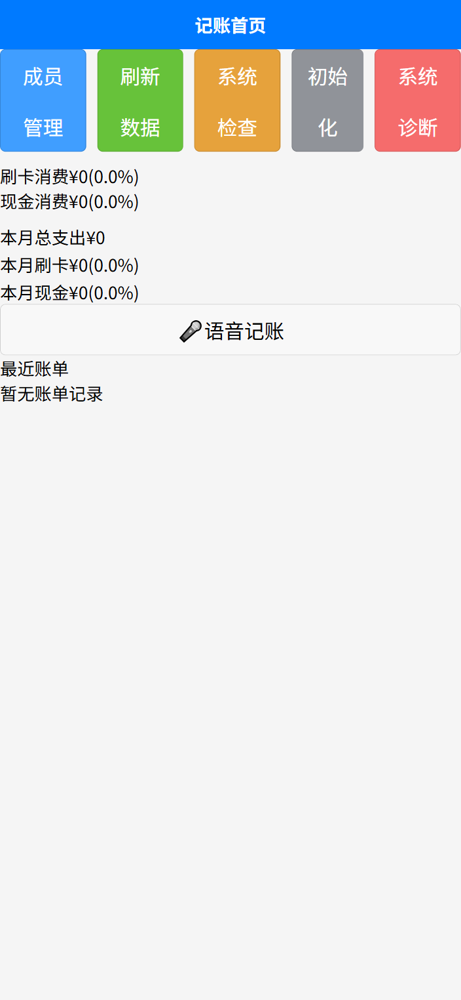

# jzAppCN 功能演示

## 📱 应用截图

### 首页 - 账单概览

### 添加账单

### 成员管理

### 数据统计

## 🎥 功能演示视频

[点击观看完整演示视频](https://www.youtube.com/watch?v=your-video-id)

## 🚀 在线体验

### H5 版本
访问地址：https://your-username.github.io/jzAppCN/

### 小程序版本
扫描二维码体验：

## 📋 功能清单

### ✅ 已实现功能
- [x] 账单添加、编辑、删除
- [x] 成员管理
- [x] 数据统计图表
- [x] 云端数据同步
- [x] 多端适配

### 🔄 开发中功能
- [ ] 预算管理
- [ ] 数据导出
- [ ] 多语言支持
- [ ] 账单分类统计

### 📅 计划功能
- [ ] 智能记账提醒
- [ ] 账单分享功能
- [ ] 数据备份恢复
- [ ] 主题切换

## 🛠️ 技术栈

- **前端框架**: uni-app + Vue.js
- **UI 组件**: uni-ui
- **图表库**: uCharts
- **后端服务**: uniCloud
- **数据库**: MongoDB Atlas
- **部署平台**: Vercel

## 📊 性能指标

- 首屏加载时间: < 2s
- 页面切换时间: < 300ms
- 数据同步延迟: < 1s
- 支持并发用户: 1000+

## 🎯 使用场景

1. **个人记账** - 日常收支记录
2. **家庭记账** - 多成员共享记账
3. **团队记账** - 项目费用管理
4. **旅行记账** - 旅行费用统计

## 📞 反馈渠道

- GitHub Issues: [提交问题](https://github.com/liushaoyin/jzapp-api/issues)
- 邮箱: your-email@example.com
- 微信: your-wechat-id 